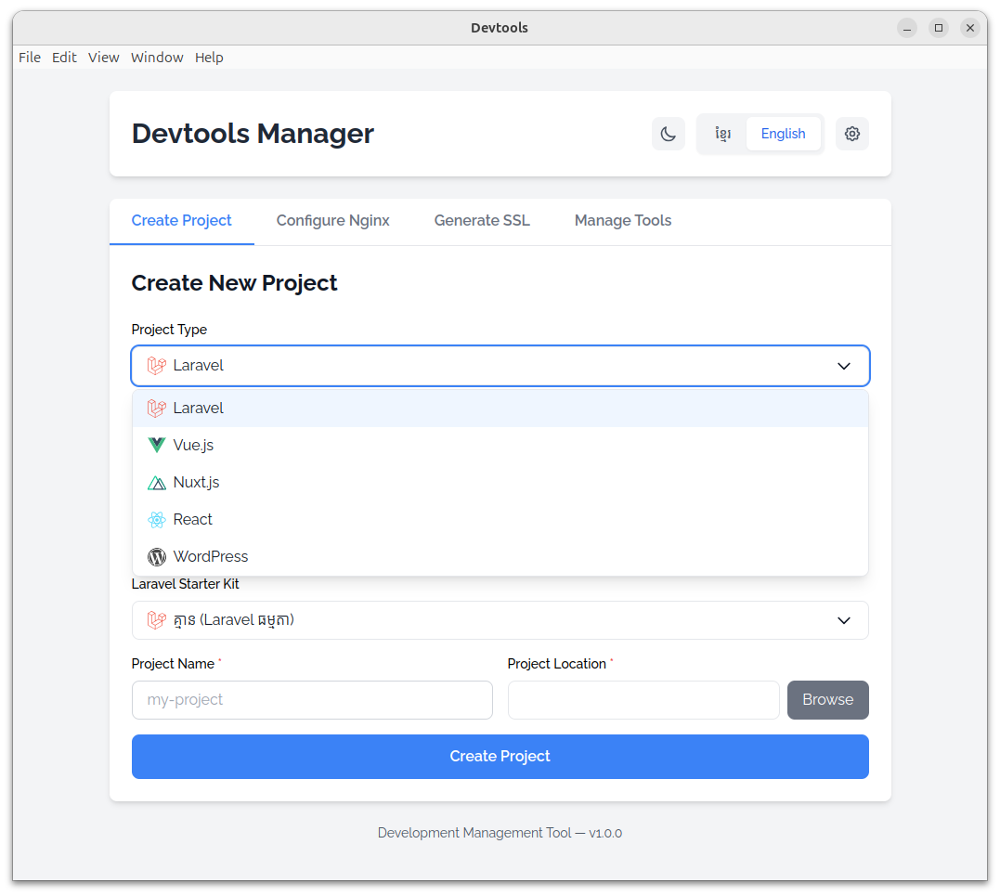
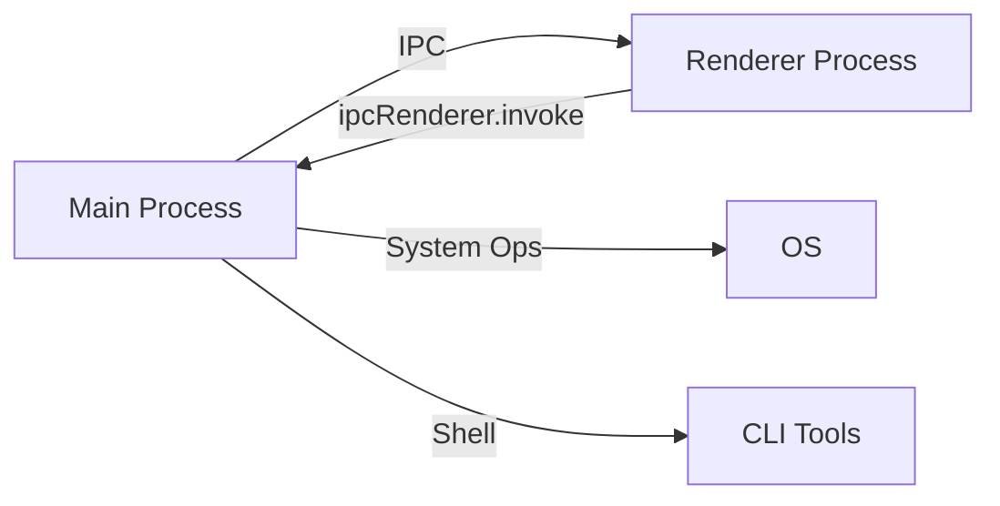

<div align="center">

# 🚀 LocalForge

**Forge your perfect local development environment with ease**

[](https://opensource.org/licenses/MIT)
[](https://www.electronjs.org/)
[](https://vuejs.org/)
[](http://makeapullrequest.com)



**A powerful Electron desktop application that streamlines local development environment setup. Create projects, configure servers, manage development tools, and generate SSL certificates—all from one intuitive interface.**

[Features](#-features) • [Installation](#-installation) • [Usage](#-usage) • [Contributing](#-contributing) • [License](#-license)

</div>

---

## ✨ Features

<table>
<tr>
<td width="50%">

### 🎯 Project Creation

- **One-click scaffolding** for Laravel, Vue, Nuxt, React, and WordPress
- **Smart directory picker** with path validation
- **Framework-specific options** and starter kits
- **Real-time validation** and error handling
- **Recent projects tracking** with quick access
- **Post-creation actions** (Nginx config, SSL, Git init)
- **Operation cancellation** support for long-running tasks

### ⚙️ Nginx Management

- **Virtual host configuration** with auto-generation
- **SSL certificate support** via mkcert integration
- **Custom port assignment** with validation
- **Automatic PHP-FPM detection** for PHP projects
- **Site management** (enable/disable, view, delete configurations)
- **Sidebar navigation** (New Site, Manage Sites)
- **Configuration details viewer** with status indicators
- **SSL management** (add/remove SSL from existing sites)

</td>
<td width="50%">

### 🛠️ Development Tools

- **PHP multi-version** support (8.0 - 8.4) with extensions
- **Composer** dependency manager installation
- **Node.js** via NVM with version switching
- **Nginx** web server setup
- **PostgreSQL & MySQL** database servers
- **One-click installation** for all tools

### 🎨 Modern Interface

- **🌙 Dark/Light mode** with system sync
- **🌐 Bilingual UI**: English & Khmer (ភាសាខ្មែរ)
- **⌨️ Keyboard shortcuts** for productivity
- **💾 Settings persistence** across sessions
- **📊 Real-time progress** indicators and operation monitoring
- **✨ Smooth animations** and transitions
- **🎯 Command palette** (`Ctrl+K`) for quick navigation
- **👋 Onboarding tour** for new users
- **🔔 Toast notifications** for instant feedback
- **📋 Recent projects** with favorites support
- **🎨 Custom select components** with dark mode
- **⚠️ Error modal** with detailed error information
- **🔄 Auto-updater** with download progress

</td>
</tr>
</table>

## 📋 Requirements

### System Requirements

| Requirement     | Version               | Notes                           |
| --------------- | --------------------- | ------------------------------- |
| **Node.js**     | ≥ 16.x                | Required to run the application |
| **npm**         | ≥ 7.x                 | Comes with Node.js              |
| **OS**          | Linux, macOS, Windows | Tested on Ubuntu 20.04+         |
| **Permissions** | sudo access           | Required for tool installation  |

### Tools (Optional - Install via App)

The following can be installed directly from the **Manage Tools** tab:

| Tool       | Versions                | Purpose                |
| ---------- | ----------------------- | ---------------------- |
| PHP        | 8.0, 8.1, 8.2, 8.3, 8.4 | Laravel backend        |
| Composer   | Latest                  | PHP dependency manager |
| Node.js    | Any via NVM             | Frontend tooling       |
| Nginx      | Latest                  | Web server             |
| PostgreSQL | Customizable            | Database               |
| MySQL      | Latest                  | Database               |

### Manual Installation

<details>
<summary><b>📦 mkcert</b> (SSL certificates) - Click to expand</summary>

```bash
# Linux
sudo apt install libnss3-tools
curl -JLO "https://dl.filippo.io/mkcert/latest?for=linux/amd64"
chmod +x mkcert-v*-linux-amd64
sudo mv mkcert-v*-linux-amd64 /usr/local/bin/mkcert
mkcert -install

# macOS
brew install mkcert
mkcert -install

# Windows
choco install mkcert
mkcert -install
```

</details>

<details>
<summary><b>🔧 NVM</b> (Node.js version manager) - Click to expand</summary>

```bash
# Linux/macOS
curl -o- https://raw.githubusercontent.com/nvm-sh/nvm/v0.39.0/install.sh | bash

# Restart terminal, then verify
nvm --version
```

</details>

## 🚀 Installation

### Quick Start

```bash
# Clone the repository
git clone https://github.com/HELMAB/localforge.git
cd localforge

# Install dependencies
npm install

# Run in development mode
npm run electron:dev
```

### Build from Source

```bash
# Build for your platform
npm run electron:build

# Or build for specific platforms
npm run build:linux    # Linux (.deb, AppImage)
npm run build:win      # Windows (.exe, NSIS)
npm run build:mac      # macOS (.dmg)
```

The built application will be in the `dist-builder/` directory.

## 💻 Usage

### Development

```bash
# Development mode with hot reload
npm run electron:dev

# Vite dev server only (browser testing)
npm run dev

# Preview production build
npm run preview
```

### Available Scripts

| Command                  | Description                                            |
| ------------------------ | ------------------------------------------------------ |
| `npm run electron:dev`   | Start dev server + Electron with HMR (recommended)     |
| `npm run dev`            | Start Vite dev server only (for UI testing in browser) |
| `npm run build`          | Build Vue app for production                           |
| `npm run preview`        | Preview production build locally                       |
| `npm run electron:build` | Build and package for distribution (default platform)  |
| `npm run build:linux`    | Build for Linux (.deb, AppImage)                       |
| `npm run build:win`      | Build for Windows (NSIS installer)                     |
| `npm run build:mac`      | Build for macOS (DMG)                                  |
| `npm run lint`           | Check code quality with ESLint                         |
| `npm run lint:fix`       | Auto-fix linting issues                                |
| `npm run format`         | Format code with Prettier                              |
| `npm run format:check`   | Check formatting without modifying files               |

> 💡 **Note:** Pre-commit hooks automatically run `lint-staged` to format and lint staged files

## 📖 User Guide

### 🎯 Create Project

<table>
<tr><td>

**Quick Guide:**

1. Navigate to **Create Project** tab (`Ctrl+1`)
2. Select project type (Laravel, Vue, Nuxt, React, WordPress)
3. Enter project name (validates automatically)
4. Browse to installation directory
5. Configure framework-specific options
6. Click **Create Project** and wait for completion
7. **Post-Creation Options:**
   - Configure Nginx virtual host
   - Generate SSL certificate
   - Initialize Git repository
   - Open in file manager
   - View project preview with commands

**Recent Projects:**

- Quick access to recently created projects
- Favorite/unfavorite projects
- One-click navigation to project directory
- View project details and creation date

</td><td>

**Supported Frameworks:**

- 🟥 **Laravel** - Full-stack PHP framework with starter kits (Breeze, Jetstream)
- 🟩 **Vue.js** - Progressive JavaScript framework with Vite + optional features
- 🟦 **Nuxt.js** - Vue-based SSR framework (v3 & v4) with templates
- ⚛️ **React** - JavaScript library with Vite bundler
- 🔵 **WordPress** - Popular CMS (latest stable)

**Advanced Features:**

- ✅ Operation cancellation support
- ✅ Real-time progress tracking
- ✅ Error handling with rollback
- ✅ Project preview with commands
- ✅ Post-creation actions panel

</td></tr>
</table>

### 🌐 Configure Nginx

<table>
<tr><td width="60%">

**Configuration Steps:**

1. Switch to **Nginx Config** tab (`Ctrl+2`)
2. **Navigate between two menus:**
   - **New Site:** Create new virtual host
   - **Sites:** Manage existing configurations
3. **For New Site:**
   - Enter domain name (e.g., `myproject.local`)
   - Select project root directory
   - Choose port (default: 80, SSL: 443)
   - Select project type (Laravel, Vue, React, Static, PHP)
   - Enable **Auto-detect PHP-FPM** for PHP projects
   - Optional: Enable SSL certificate generation
   - Click **Configure** and enter sudo password
4. **For Existing Sites:**
   - View all configurations with status indicators
   - Enable/Disable sites
   - Add or remove SSL certificates
   - View detailed configuration
   - Delete configurations

> ⚠️ **Important:** Requires sudo privileges for system configuration
>
> 💡 **Tip:** Add domain to `/etc/hosts` for local DNS resolution

</td><td width="40%">

**Key Features:**

- ✅ Sidebar navigation (New Site / Sites)
- ✅ Automatic PHP-FPM socket detection
- ✅ SSL certificate generation with mkcert
- ✅ Add/Remove SSL from existing sites
- ✅ Custom port configuration
- ✅ Automatic symlink creation
- ✅ Nginx test & reload
- ✅ Site status indicators (Active/Inactive)
- ✅ Configuration details viewer
- ✅ Enable/Disable controls
- ✅ Delete with confirmation

</td></tr>
</table>

### 🔒 SSL Certificate Management

**Secure your local development with HTTPS:**

**Option 1: During Nginx Configuration**

- Enable "Enable SSL Certificate" checkbox when creating a new virtual host
- SSL certificate will be automatically generated and configured

**Option 2: Add SSL to Existing Site**

- Go to **Nginx Config** tab → **Sites** menu
- View site details
- Click "Add SSL" button for the site
- SSL certificate will be generated and Nginx configuration updated

**Option 3: Standalone Generation** (via NginxConfigForm)

- Open **Nginx Config** tab
- Use the SSL generation section in the form
- Certificates are saved to `/etc/nginx/ssl/` directory

> 📝 **Prerequisites:** mkcert must be installed and initialized
>
> 🔐 **Note:** Generated certificates are trusted locally by your system and stored in `/etc/nginx/ssl/`
>
> 🔄 **SSL Management:** You can also remove SSL from existing sites through the site details panel

### ⚙️ Settings & Configuration

**Manage application settings and preferences:**

Access via **Settings** tab (`Ctrl+,`)

**Available Settings:**

- **🌙 Appearance** - Dark/Light mode toggle with system sync
- **🌐 Language** - Switch between English and Khmer
- **💾 Backup & Restore** - Export/import app settings and configurations
- **🔄 Auto-Updates** - Check for app updates, download and install
- **📊 Operation Logs** - View history of all operations
- **🎯 Onboarding** - Reset onboarding tour for new users

**Update Management:**

- Automatic update checks on app start
- Download updates in background
- Install updates on app quit
- Manual update check available
- Update progress tracking

**Backup Features:**

- Export all settings to JSON file
- Import settings from backup file
- Includes: preferences, recent projects, favorites, custom configurations

### 🛠️ Development Services Management

**Install and manage essential development tools:**

Access via **Manage Services** tab (`Ctrl+4`)

**Features:**

- **Sidebar navigation** - Quick access to each tool section
- **Status checking** - View installed versions automatically
- **One-click installation** - Install tools with sudo authentication
- **Multi-version support** - Install and switch between versions

| Tool           | Capabilities                        | Actions                                                      |
| -------------- | ----------------------------------- | ------------------------------------------------------------ |
| **PHP**        | Multi-version (8.0-8.4), extensions | Install versions, add extensions (mbstring, xml, curl, etc.) |
| **Composer**   | Global package manager              | Install/upgrade Composer                                     |
| **Node.js**    | Multiple versions via NVM           | Install versions, set default version                        |
| **Nginx**      | High-performance web server         | Quick installation with auto-start                           |
| **PostgreSQL** | Relational database                 | Custom version support                                       |
| **MySQL**      | Popular database server             | Latest stable version installation                           |

> 🔑 **All installations require sudo privileges**
>
> ✅ **Auto-detection:** Automatically checks for installed tools on app start
>
> 📊 **Status indicators:** Clear visual feedback for installation status

### ⚡ Productivity Features & Shortcuts

| Feature              | Shortcut | Description                         |
| -------------------- | -------- | ----------------------------------- |
| **Command Palette**  | `Ctrl+K` | Quick command access and navigation |
| **Create Project**   | `Ctrl+1` | Quick access to project creation    |
| **Nginx Config**     | `Ctrl+2` | Configure virtual hosts             |
| **Manage Tools**     | `Ctrl+4` | Install development tools           |
| **Settings**         | `Ctrl+,` | Open settings panel                 |
| **Toggle Dark Mode** | `Ctrl+D` | Switch theme instantly              |
| **Switch Language**  | `Ctrl+L` | English ↔ Khmer                    |

**Additional Features:**

- **📋 Recent Projects** - Quick access to recently created projects
- **⭐ Favorites** - Star your frequently used projects
- **🔄 Operation Monitor** - Track long-running operations with cancel support
- **👋 Onboarding Tour** - Interactive guide for first-time users
- **🔔 Toast Notifications** - Non-intrusive feedback messages
- **💾 Auto-save Settings** - All preferences persist automatically
- **🔄 Auto-updater** - Automatic app updates with progress tracking
- **📦 Backup & Restore** - Export/import app settings and configurations

## 🏗️ Tech Stack

<table>
<tr>
<td>

**Frontend**

- Vue 3 (Composition API)
- Vue Router (hash mode)
- Vue I18n (bilingual)
- Vue Toastification
- Tailwind CSS
- Custom UI components

</td>
<td>

**Desktop**

- Electron 28
- IPC communication
- Node.js integration
- sudo-prompt
- electron-updater

</td>
<td>

**Build & Dev**

- Vite 5 (HMR)
- ESLint + Prettier
- Husky (git hooks)
- lint-staged
- electron-builder
- concurrently + wait-on

</td>
</tr>
</table>

## 📁 Project Structure

```
localforge/
├── 📂 src/
│   ├── 📂 main/
│   │   ├── main.js                    # Electron main process (IPC handlers)
│   │   └── operationRollback.js       # Rollback system for failed operations
│   └── 📂 renderer/
│       ├── index.html                 # Entry point
│       └── 📂 src/
│           ├── main.js                # Vue app bootstrap
│           ├── App.vue                # Root component with global shortcuts
│           ├── 📂 components/
│           │   ├── layout/           # AppHeader, TabNavigation, AppFooter
│           │   ├── common/           # Reusable UI components:
│           │   │                      # - StatusMessage, ProgressBar, InfoBox
│           │   │                      # - CommandPalette, OnboardingTour
│           │   │                      # - OperationMonitor, ErrorModal
│           │   │                      # - DirectorySelector, CustomSelect
│           │   ├── forms/            # Feature forms:
│           │   │                      # - CreateProjectForm, NginxConfigForm
│           │   │                      # - ManageToolsForm, RecentProjects
│           │   │                      # - PostCreationActions, ProjectPreview
│           │   │                      # - tool-sections/ (PHP, Node, etc.)
│           │   └── settings/         # BackupRestore, UpdateChecker
│           ├── 📂 views/              # Route wrappers (thin components)
│           ├── 📂 composables/        # 19 composables for business logic
│           ├── 📂 router/             # Vue Router (hash mode, 4 routes)
│           ├── 📂 i18n/               # Vue I18n setup + locales (km/en)
│           ├── 📂 utils/              # Utility functions
│           └── 📂 assets/             # Styles, icons, images
├── 📂 .husky/                          # Git hooks (pre-commit)
├── vite.config.js                      # Vite config (custom root)
├── tailwind.config.js                  # Tailwind CSS config
├── eslint.config.mjs                   # ESLint flat config
├── .prettierrc.json                    # Prettier config
├── package.json                        # Dependencies & scripts
└── CLAUDE.md                           # Development documentation
```

## 🏛️ Architecture

### Process Model



<table>
<tr>
<td width="50%">

**Main Process** (`src/main/main.js`)

- System operations (file I/O, shell)
- Sudo operations (tool installation)
- IPC handlers for renderer
- Window management
- **Dev:** Loads `localhost:5173`
- **Prod:** Loads built files

</td>
<td width="50%">

**Renderer Process** (Vue 3 App)

- Vue 3 with Composition API
- IPC via composables pattern
- Hash routing (Electron compat)
- Reactive i18n switching (km/en)
- Tailwind CSS styling
- Custom UI components
- Toast notifications
- LocalStorage persistence

</td>
</tr>
</table>

### Composables Pattern

All IPC calls wrapped in reusable composables:

| Composable               | Purpose                                 |
| ------------------------ | --------------------------------------- |
| `useIpc()`               | Base IPC communication                  |
| `useProject()`           | Project creation, directory selection   |
| `useNginx()`             | Nginx configuration and site management |
| `useSsl()`               | SSL certificate generation              |
| `useTools()`             | Tool installation & management          |
| `useStatus()`            | Status messages (legacy)                |
| `useToast()`             | Toast notifications                     |
| `useSettings()`          | Settings persistence (localStorage)     |
| `useDarkMode()`          | Theme management                        |
| `useKeyboardShortcuts()` | Global keyboard shortcuts               |
| `useRecentProjects()`    | Recent projects tracking                |
| `useFavorites()`         | Project favorites management            |
| `useProgress()`          | Progress tracking for operations        |
| `useOperationControl()`  | Operation cancellation support          |
| `useOperationLogger()`   | Operation logging and history           |
| `useOnboarding()`        | Onboarding tour management              |
| `useBackup()`            | Backup and restore settings             |
| `useUpdater()`           | Auto-updater functionality              |
| `useErrorModal()`        | Error modal management                  |

## 🔧 Troubleshooting

<details>
<summary><b>🐛 Development Issues</b></summary>

### Port already in use

```bash
# Kill process on port 5173
lsof -ti:5173 | xargs kill -9
npm run electron:dev
```

### Blank Electron window

1. Open DevTools (`F12` or `Ctrl+Shift+I`)
2. Check console for errors
3. Verify Vite server: `http://localhost:5173`
4. Ensure `NODE_ENV=development`

### Hot reload not working

```bash
# Restart dev server
npm run electron:dev
```

### Duplicate Electron windows

- Ensure `vite-plugin-electron` is NOT in `vite.config.js`
- Already fixed in latest version

</details>

<details>
<summary><b>🌐 Nginx Issues</b></summary>

**Configuration fails:**

- ✅ Install Nginx via "Manage Tools" tab
- ✅ Verify sudo privileges
- ✅ Check project path exists
- ✅ Ensure port is not in use

**Virtual host not working:**

- Add domain to `/etc/hosts`: `127.0.0.1 yourdomain.local`
- Restart Nginx: `sudo systemctl restart nginx`

</details>

<details>
<summary><b>🔒 SSL Certificate Issues</b></summary>

```bash
# Verify mkcert installation
mkcert -version

# Install local CA
mkcert -install

# Check certificate location
ls ~/certs/
```

</details>

<details>
<summary><b>🛠️ Tool Installation Issues</b></summary>

| Issue                         | Solution                             |
| ----------------------------- | ------------------------------------ |
| **Permission denied**         | Enter correct sudo password          |
| **PHP install fails**         | Install `software-properties-common` |
| **Node versions not showing** | Install NVM first                    |
| **Database install fails**    | Run `sudo apt update`                |
| **Composer not found**        | Install via "Manage Tools" first     |

</details>

<details>
<summary><b>🎨 UI/Display Issues</b></summary>

- **Dark mode not working:** Check system preferences
- **Language not switching:** Clear browser cache (if testing in browser)
- **Icons missing:** Ensure `src/renderer/src/assets/` is intact

</details>

> 💡 **Tip:** Always check the in-app status messages for specific error details!

## 🤝 Contributing

We welcome contributions! Here's how to get started:

### 🚦 Getting Started

1. **Fork** the repository
2. **Clone** your fork
   ```bash
   git clone https://github.com/YOUR_USERNAME/localforge.git
   cd localforge
   ```
3. **Install dependencies**
   ```bash
   npm install
   ```
4. **Create a branch**
   ```bash
   git checkout -b feature/amazing-feature
   ```
5. **Start development server**
   ```bash
   npm run electron:dev
   ```
6. **Make changes** and test thoroughly
7. **Commit** with meaningful messages (Husky will auto-lint)
   ```bash
   git commit -m "feat: add amazing feature"
   ```
8. **Push** to your fork
   ```bash
   git push origin feature/amazing-feature
   ```
9. **Open a Pull Request**

### 📝 Contribution Guidelines

- ✅ Run `npm run lint:fix` before committing
- ✅ Test with `npm run electron:dev`
- ✅ Follow existing code style
- ✅ Write clear commit messages ([Conventional Commits](https://www.conventionalcommits.org/))
- ✅ Update documentation if needed
- ✅ Add tests for new features

### 🎯 Areas for Contribution

- 🐛 Bug fixes
- ✨ New features (Docker support, VS Code integration, etc.)
- 📖 Documentation improvements
- 🌐 Translations (add new languages beyond km/en)
- 🎨 UI/UX enhancements
- ⚡ Performance optimizations
- 🧪 Tests (unit tests, E2E tests)
- 🔧 New project types (Next.js, Svelte, etc.)
- 📦 Package manager support (pnpm, yarn, bun)
- 🗄️ Database management UI improvements

### 🔒 Code Quality

This project uses automated code quality tools:

| Tool            | Purpose             | Command             |
| --------------- | ------------------- | ------------------- |
| **ESLint**      | Code linting        | `npm run lint`      |
| **Prettier**    | Code formatting     | `npm run format`    |
| **Husky**       | Git hooks           | Auto-runs on commit |
| **lint-staged** | Staged file linting | Auto-runs on commit |

**Pre-commit hook** automatically validates code before committing.

> **Emergency bypass:** `git commit --no-verify` (use sparingly!)

## 📄 License

This project is licensed under the **MIT License** - see the [LICENSE](LICENSE) file for details.

```
MIT License - Copyright (c) 2025 Mab Hel

Permission is hereby granted, free of charge, to any person obtaining a copy
of this software and associated documentation files (the "Software"), to deal
in the Software without restriction, including without limitation the rights
to use, copy, modify, merge, publish, distribute, sublicense, and/or sell
copies of the Software, and to permit persons to whom the Software is
furnished to do so, subject to the following conditions:

The above copyright notice and this permission notice shall be included in all
copies or substantial portions of the Software.
```

## 🙏 Acknowledgments

Built with amazing open-source technologies:

- **[Electron](https://www.electronjs.org/)** - Cross-platform desktop framework
- **[Vue 3](https://vuejs.org/)** - Progressive JavaScript framework with Composition API
- **[Vite](https://vitejs.dev/)** - Lightning-fast build tool and dev server
- **[Tailwind CSS](https://tailwindcss.com/)** - Utility-first CSS framework
- **[Vue Router](https://router.vuejs.org/)** - Official routing library
- **[Vue I18n](https://vue-i18n.intlify.dev/)** - Internationalization plugin
- **[VeeValidate](https://vee-validate.logaretm.com/)** - Form validation
- **[mkcert](https://github.com/FiloSottile/mkcert)** - Local SSL certificates

Special thanks to all open-source contributors! 🎉

## 📞 Support & Contact

- 🐛 **Issues:** [GitHub Issues](https://github.com/HELMAB/localforge/issues)
- 💬 **Discussions:** [GitHub Discussions](https://github.com/HELMAB/localforge/discussions)
- 📧 **Email:** mabhelitc@gmail.com
- 🌐 **Website:** [helmab.netlify.app](https://helmab.netlify.app)

---

<div align="center">

**⭐ Star this repo if you find it helpful!**

Made with ❤️ by [Mab Hel](https://helmab.netlify.app)

[⬆ Back to Top](#-localforge)

</div>
