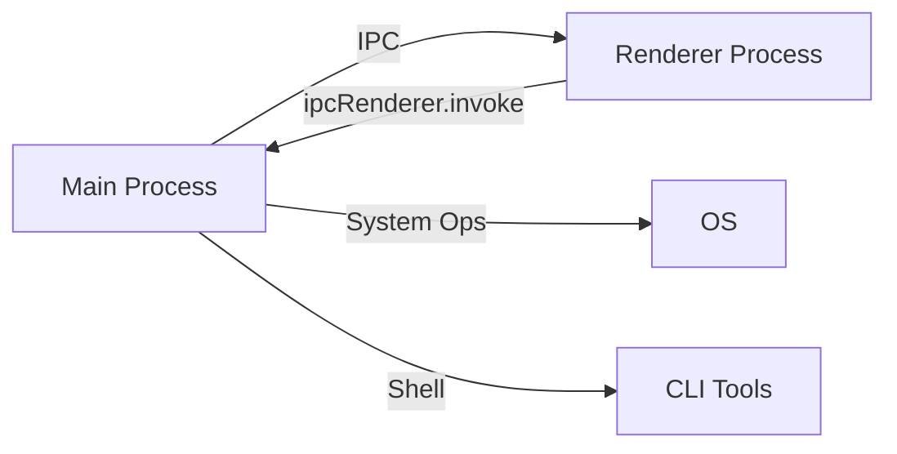

<div align="center">

# 🚀 Dev Tools Manager

**A modern, powerful desktop application for managing development projects and tools**

[](https://opensource.org/licenses/MIT)
[](https://www.electronjs.org/)
[](https://vuejs.org/)
[](http://makeapullrequest.com)


**Streamline your development workflow with project scaffolding, server configuration, and tool management—all in one beautiful desktop app.**

[Features](#-features) • [Installation](#-installation) • [Usage](#-usage) • [Contributing](#-contributing) • [License](#-license)

</div>

---

## ✨ Features

<table>
<tr>
<td width="50%">

### 🎯 Project Management
- **Quick scaffolding** for Laravel, Vue, Nuxt, React, WordPress
- **Smart directory selection** with recent paths
- **Real-time validation** with VeeValidate & Yup
- **Project templates** with best practices

### ⚙️ Server Configuration
- **Automated Nginx** virtual host setup
- **SSL certificates** generation with mkcert
- **Port configuration** with conflict detection
- **Auto PHP-FPM** detection and configuration

</td>
<td width="50%">

### 🛠️ Tool Management
- **PHP versions** (8.0 → 8.4) with extensions
- **Composer** global installation
- **Node.js** version management via NVM
- **Databases**: PostgreSQL, MySQL
- **Nginx** web server installation

### 🎨 User Experience
- **🌙 Dark mode** with system preference sync
- **🌐 Bilingual**: English & Khmer (ភាសាខ្មែរ)
- **⌨️ Keyboard shortcuts** for power users
- **💾 Persistent settings** & preferences
- **📊 Progress tracking** for long operations

</td>
</tr>
</table>

## 📋 Requirements

### System Requirements

| Requirement | Version | Notes |
|------------|---------|-------|
| **Node.js** | ≥ 16.x | Required to run the application |
| **npm** | ≥ 7.x | Comes with Node.js |
| **OS** | Linux, macOS, Windows | Tested on Ubuntu 20.04+ |
| **Permissions** | sudo access | Required for tool installation |

### Tools (Optional - Install via App)

The following can be installed directly from the **Manage Tools** tab:

| Tool | Versions | Purpose |
|------|----------|---------|
| PHP | 8.0, 8.1, 8.2, 8.3, 8.4 | Laravel backend |
| Composer | Latest | PHP dependency manager |
| Node.js | Any via NVM | Frontend tooling |
| Nginx | Latest | Web server |
| PostgreSQL | Customizable | Database |
| MySQL | Latest | Database |

### Manual Installation

<details>
<summary><b>📦 mkcert</b> (SSL certificates) - Click to expand</summary>


```bash
# Linux
sudo apt install libnss3-tools
curl -JLO "https://dl.filippo.io/mkcert/latest?for=linux/amd64"
chmod +x mkcert-v*-linux-amd64
sudo mv mkcert-v*-linux-amd64 /usr/local/bin/mkcert
mkcert -install

# macOS
brew install mkcert
mkcert -install

# Windows
choco install mkcert
mkcert -install
```

</details>

<details>
<summary><b>🔧 NVM</b> (Node.js version manager) - Click to expand</summary>

```bash
# Linux/macOS
curl -o- https://raw.githubusercontent.com/nvm-sh/nvm/v0.39.0/install.sh | bash

# Restart terminal, then verify
nvm --version
```

</details>

## 🚀 Installation

### Quick Start

```bash
# Clone the repository
git clone https://github.com/yourusername/dev-tools-app.git
cd dev-tools-app

# Install dependencies
npm install

# Run in development mode
npm run electron:dev
```

### Build from Source

```bash
# Build for your platform
npm run electron:build

# Or build for specific platforms
npm run build:linux    # Linux (.deb, AppImage)
npm run build:win      # Windows (.exe, NSIS)
npm run build:mac      # macOS (.dmg)
```

The built application will be in the `dist-builder/` directory.

## 💻 Usage

### Development

```bash
# Development mode with hot reload
npm run electron:dev

# Vite dev server only (browser testing)
npm run dev

# Preview production build
npm run preview
```

### Available Scripts

| Command | Description |
|---------|-------------|
| `npm run electron:dev` | Start dev server + Electron with HMR |
| `npm run dev` | Start Vite dev server only |
| `npm run build` | Build Vue app for production |
| `npm run electron:build` | Build and package for distribution |
| `npm run lint` | Check code quality with ESLint |
| `npm run lint:fix` | Auto-fix linting issues |
| `npm run format` | Format code with Prettier |

## 📖 User Guide

### 🎯 Create Project

<table>
<tr><td>

**Step-by-step:**
1. Click the **Create Project** tab (`Ctrl+1`)
2. Select your framework/CMS
3. Enter a project name (auto-validated)
4. Choose installation directory
5. Configure framework-specific options
6. Click **Create Project**

</td><td>

**Supported Types:**
- 🟥 **Laravel** (with Composer)
- 🟩 **Vue.js** (Vite template)
- 🟦 **Nuxt.js** (latest version)
- ⚛️ **React** (with Vite)
- 🔵 **WordPress** (latest)

</td></tr>
</table>

### 🌐 Configure Nginx

<table>
<tr><td width="60%">

**Quick Setup:**
1. Navigate to **Nginx Config** tab (`Ctrl+2`)
2. Enter domain (e.g., `myproject.local`)
3. Browse to project root directory
4. Set port (default: 80) or enable SSL (443)
5. Enable **Auto-detect PHP-FPM** for PHP projects
6. Click **Configure**

> ⚠️ **Note:** Requires sudo password for system configuration

</td><td width="40%">

**Features:**
- ✅ Auto PHP-FPM detection
- ✅ SSL support (port 443)
- ✅ Custom port assignment
- ✅ Symlink to sites-enabled
- ✅ Auto Nginx reload

</td></tr>
</table>

### 🔒 Generate SSL Certificate

Simple HTTPS setup with mkcert:
1. Go to **SSL Generator** tab (`Ctrl+3`)
2. Enter domain name
3. Click **Generate Certificate**
4. Certificates saved to `~/certs/`

### 🛠️ Manage Tools

**One-click installation** for development tools:

| Tool | Features | Shortcut |
|------|----------|----------|
| **PHP** | Multi-version support (8.0-8.4), extensions | Install specific versions |
| **Composer** | Global installation | Check version & install |
| **Node.js** | NVM integration, version switching | Set default version |
| **Nginx** | Web server | Quick install |
| **PostgreSQL** | Version selection | Custom version support |
| **MySQL** | Database server | Latest stable |

Access via **Manage Tools** tab (`Ctrl+4`)

### ⚡ Quick Tips

| Action | Method |
|--------|--------|
| **Switch Language** | Header button or `Ctrl+L` |
| **Toggle Dark Mode** | Moon/Sun icon or `Ctrl+D` |
| **Open Settings** | Gear icon or `Ctrl+,` |
| **Navigate Tabs** | `Ctrl+1` through `Ctrl+4` |
| **View Shortcuts** | Press `Ctrl+/` anytime |

## 🏗️ Tech Stack

<table>
<tr>
<td>

**Frontend**
- Vue 3 (Composition API)
- Vue Router (hash mode)
- Vue I18n (bilingual)
- VeeValidate + Yup
- Tailwind CSS

</td>
<td>

**Desktop**
- Electron 28
- IPC communication
- Node.js integration
- sudo-prompt

</td>
<td>

**Build & Dev**
- Vite (HMR)
- ESLint + Prettier
- Husky (git hooks)
- electron-builder

</td>
</tr>
</table>

## 📁 Project Structure

```
dev-tools-app/
├── 📂 src/
│   ├── 📂 main/
│   │   └── main.js                    # Electron main process (IPC)
│   └── 📂 renderer/
│       ├── index.html                 # Entry point
│       └── 📂 src/
│           ├── main.js                # Vue app bootstrap
│           ├── App.vue                # Root component
│           ├── 📂 components/
│           │   ├── layout/           # Header, Nav, Footer
│           │   ├── common/           # Reusable UI
│           │   └── forms/            # Feature forms
│           ├── 📂 views/              # Route views
│           ├── 📂 composables/        # Business logic + IPC
│           ├── 📂 router/             # Vue Router
│           ├── 📂 i18n/               # Translations (km/en)
│           └── 📂 assets/             # Styles, icons, images
├── vite.config.js
├── tailwind.config.js
├── eslint.config.mjs
└── package.json
```

## 🏛️ Architecture

### Process Model



<table>
<tr>
<td width="50%">

**Main Process** (`src/main/main.js`)
- System operations (file I/O, shell)
- Sudo operations (tool installation)
- IPC handlers for renderer
- Window management
- **Dev:** Loads `localhost:5173`
- **Prod:** Loads built files

</td>
<td width="50%">

**Renderer Process** (Vue 3 App)
- Vue 3 with Composition API
- IPC via composables
- Hash routing (Electron compat)
- Reactive i18n switching
- Tailwind CSS styling
- VeeValidate forms

</td>
</tr>
</table>

### Composables Pattern

All IPC calls wrapped in reusable composables:

| Composable | Purpose |
|------------|---------|
| `useIpc()` | Base IPC communication |
| `useProject()` | Project creation, directory selection |
| `useNginx()` | Nginx configuration |
| `useSsl()` | SSL certificate generation |
| `useTools()` | Tool installation & management |
| `useStatus()` | Status messages |
| `useSettings()` | Settings persistence |
| `useDarkMode()` | Theme management |

## 🔧 Troubleshooting

<details>
<summary><b>🐛 Development Issues</b></summary>

### Port already in use
```bash
# Kill process on port 5173
lsof -ti:5173 | xargs kill -9
npm run electron:dev
```

### Blank Electron window
1. Open DevTools (`F12` or `Ctrl+Shift+I`)
2. Check console for errors
3. Verify Vite server: `http://localhost:5173`
4. Ensure `NODE_ENV=development`

### Hot reload not working
```bash
# Restart dev server
npm run electron:dev
```

### Duplicate Electron windows
- Ensure `vite-plugin-electron` is NOT in `vite.config.js`
- Already fixed in latest version

</details>

<details>
<summary><b>🌐 Nginx Issues</b></summary>

**Configuration fails:**
- ✅ Install Nginx via "Manage Tools" tab
- ✅ Verify sudo privileges
- ✅ Check project path exists
- ✅ Ensure port is not in use

**Virtual host not working:**
- Add domain to `/etc/hosts`: `127.0.0.1 yourdomain.local`
- Restart Nginx: `sudo systemctl restart nginx`

</details>

<details>
<summary><b>🔒 SSL Certificate Issues</b></summary>

```bash
# Verify mkcert installation
mkcert -version

# Install local CA
mkcert -install

# Check certificate location
ls ~/certs/
```

</details>

<details>
<summary><b>🛠️ Tool Installation Issues</b></summary>

| Issue | Solution |
|-------|----------|
| **Permission denied** | Enter correct sudo password |
| **PHP install fails** | Install `software-properties-common` |
| **Node versions not showing** | Install NVM first |
| **Database install fails** | Run `sudo apt update` |
| **Composer not found** | Install via "Manage Tools" first |

</details>

<details>
<summary><b>🎨 UI/Display Issues</b></summary>

- **Dark mode not working:** Check system preferences
- **Language not switching:** Clear browser cache (if testing in browser)
- **Icons missing:** Ensure `src/renderer/src/assets/` is intact

</details>

> 💡 **Tip:** Always check the in-app status messages for specific error details!

## 🤝 Contributing

We welcome contributions! Here's how to get started:

### 🚦 Getting Started

1. **Fork** the repository
2. **Clone** your fork
   ```bash
   git clone https://github.com/yourusername/dev-tools-app.git
   cd dev-tools-app
   ```
3. **Create a branch**
   ```bash
   git checkout -b feature/amazing-feature
   ```
4. **Make changes** and test thoroughly
5. **Commit** with meaningful messages
   ```bash
   git commit -m "feat: add amazing feature"
   ```
6. **Push** to your fork
   ```bash
   git push origin feature/amazing-feature
   ```
7. **Open a Pull Request**

### 📝 Contribution Guidelines

- ✅ Run `npm run lint:fix` before committing
- ✅ Test with `npm run electron:dev`
- ✅ Follow existing code style
- ✅ Write clear commit messages ([Conventional Commits](https://www.conventionalcommits.org/))
- ✅ Update documentation if needed
- ✅ Add tests for new features

### 🎯 Areas for Contribution

- 🐛 Bug fixes
- ✨ New features
- 📖 Documentation improvements
- 🌐 Translations (add new languages)
- 🎨 UI/UX enhancements
- ⚡ Performance optimizations
- 🧪 Tests

### 🔒 Code Quality

This project uses automated code quality tools:

| Tool | Purpose | Command |
|------|---------|---------|
| **ESLint** | Code linting | `npm run lint` |
| **Prettier** | Code formatting | `npm run format` |
| **Husky** | Git hooks | Auto-runs on commit |
| **lint-staged** | Staged file linting | Auto-runs on commit |

**Pre-commit hook** automatically validates code before committing.

> **Emergency bypass:** `git commit --no-verify` (use sparingly!)

## 📄 License

This project is licensed under the **MIT License** - see the [LICENSE](LICENSE) file for details.

```
MIT License - Copyright (c) 2024 Mab Hel

Permission is hereby granted, free of charge, to any person obtaining a copy
of this software and associated documentation files (the "Software"), to deal
in the Software without restriction, including without limitation the rights
to use, copy, modify, merge, publish, distribute, sublicense, and/or sell
copies of the Software, and to permit persons to whom the Software is
furnished to do so, subject to the following conditions:

The above copyright notice and this permission notice shall be included in all
copies or substantial portions of the Software.
```

## 🙏 Acknowledgments

- **[Electron](https://www.electronjs.org/)** - Desktop app framework
- **[Vue.js](https://vuejs.org/)** - Progressive JavaScript framework
- **[Vite](https://vitejs.dev/)** - Next generation frontend tooling
- **[Tailwind CSS](https://tailwindcss.com/)** - Utility-first CSS framework
- All open-source contributors

## 📞 Support & Contact

- 🐛 **Issues:** [GitHub Issues](https://github.com/yourusername/dev-tools-app/issues)
- 💬 **Discussions:** [GitHub Discussions](https://github.com/yourusername/dev-tools-app/discussions)
- 📧 **Email:** mabhelitc@gmail.com
- 🌐 **Website:** [helmab.netlify.app](https://helmab.netlify.app)

---

<div align="center">

**⭐ Star this repo if you find it helpful!**

Made with ❤️ by [Mab Hel](https://helmab.netlify.app)

[⬆ Back to Top](#-dev-tools-manager)

</div>
